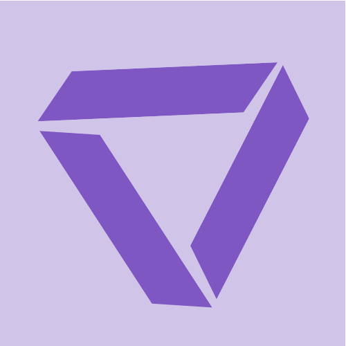

# Trivex Landing Page

A modern web3-styled landing page for Trivex, a DApp empowering trading on Starknet.



## Overview

This landing page showcases the Trivex trading platform with a modern web3 design aesthetic, featuring:

- Responsive design with mobile-friendly layouts
- Modern UI with animated elements and transitions
- Web3-inspired color scheme and visual elements
- Clean component-based architecture using React and Material UI

## Technologies Used

- **React**: Frontend library for building the user interface
- **Material UI**: Component library for consistent, responsive design
- **CSS-in-JS**: Using MUI's styled API for component styling
- **Responsive Design**: Mobile-first approach ensuring compatibility across devices

## Project Structure

```
trivex_landing/
├── public/                 # Public assets and HTML template
├── src/                    # Source code
│   ├── assets/             # Images and static assets
│   ├── components/         # Reusable UI components
│   │   ├── Header.jsx      # Hero section component
│   │   ├── Navbar.jsx      # Navigation bar component
│   │   └── Footer.jsx      # Footer component
│   ├── pages/              # Page components
│   │   └── MainPage.js     # Main landing page
│   ├── App.js              # Main application component
│   └── index.js            # Entry point
└── README.md               # Project documentation
```

## Features

- **Custom Theming**: Web3-inspired dark theme with purple accents
- **Animated Elements**: Scroll animations, hover effects, and transitions
- **Responsive UI**: Adapts to mobile, tablet, and desktop viewports
- **Modern Layout**: Clean and intuitive design focusing on user experience
- **Performance Optimized**: Fast loading and rendering

## Getting Started

### Prerequisites

- Node.js (v14 or later)
- npm or yarn

### Installation

1. Clone the repository:
```bash
git clone https://github.com/yourusername/trivex_landing.git
cd trivex_landing
```

2. Install dependencies:
```bash
npm install
# or
yarn
```

3. Start the development server:
```bash
npm start
# or
yarn start
```

4. Open your browser and navigate to `http://localhost:3000`

## Customization

- **Colors**: Update the theme in `App.js` to change the color scheme
- **Content**: Modify text content in the respective components
- **Images**: Replace images in the `src/assets` directory
- **Components**: Add or modify components in the `src/components` directory

## Deployment

This project can be deployed to any static site hosting service:

```bash
npm run build
# or
yarn build
```

The build artifacts will be stored in the `build/` directory, ready for deployment to services like Netlify, Vercel, or GitHub Pages.

## Acknowledgements

- Design inspiration from modern web3 and DeFi platforms
- Material UI for the component library
- React team for the excellent frontend framework